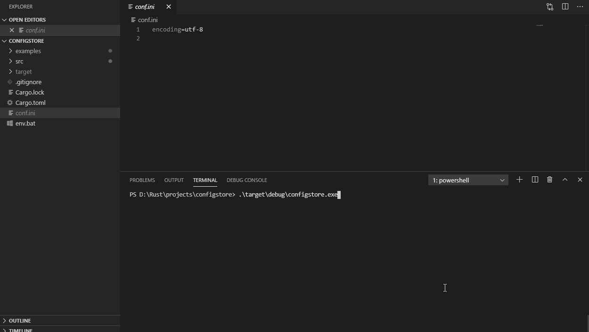

# Confini
 A cli application allowing secure and efficient storage, management of credentials (username & password) in a `conf.ini` file. 

## TODO:
- Enable retieval of credentials
- Update crypto
- Enhance scope of conf.ini file

## Usage
1. Initiate a conf.ini file

1. Initiate a conf.ini file

1. Initiate a conf.ini file

1. Initiate a conf.ini file

## Contribute
There are many ways in which you can participate in the project, for example:

- Submit bugs and feature requests, and help me verify as they are checked in
- Review source code changes
- Review the documentation and make pull requests for anything from typos to new content

If you are interested in fixing issues and contributing directly to the code base, please feel free to raise a PR.
